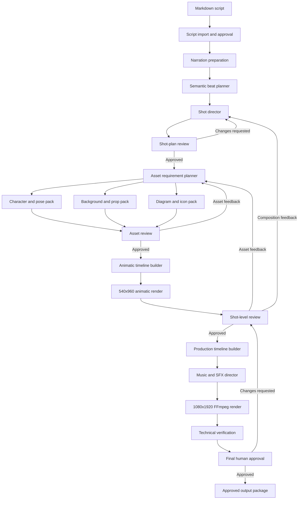

# Local Hybrid 2D Animation Production System

**Document type:** Greenfield architecture and implementation design plan  
**Status:** Proposed implementation plan  
**Target format:** Short-form first, long-form compatible later  
**Primary runtime:** Windows, Python 3.12, FFmpeg, SQLite, local filesystem  
**Primary hardware:** Lenovo laptop, RTX 4050 Laptop GPU, 16 GB system RAM  
**Cost target:** Zero recurring software or API cost  
**Repository strategy:** New standalone repository; current AI Media OS is read-only reference  

## 1. Executive Summary

AI Media OS currently produces too many visually similar results because a scene is commonly
represented by one flattened generated image. Camera movement, captions, overlays, and sound can
improve that image, but they cannot create genuinely different staging, character actions, object
interactions, or explanatory diagrams.

The proposed system is a new standalone application. It does not replace or modify AI Media OS.
AI Media OS remains available as a read-only reference for lessons, algorithms, tests, and small
components that may be deliberately reimplemented or copied after review.

The new system uses a hybrid production model:

1. The script is divided into short semantic visual beats.
2. A deterministic shot director assigns a meaningful composition to each beat.
3. AI image generation creates reusable source assets, not complete videos.
4. Characters, poses, backgrounds, props, icons, diagrams, and effects remain separate layers.
5. Python creates a validated, immutable shot and animation plan.
6. FFmpeg composes and animates the approved layers deterministically.
7. A low-resolution animatic is reviewed before expensive production assets or final rendering.
8. Rejected shots collect feedback and create new versions without destroying approved history.

The intended visual result is an original illustrated motion-graphics explainer with meaningful
visual changes every 1.5 to 2.5 seconds. It should use recurring characters only when they help the
story and use object-led shots, diagrams, comparisons, environments, and reveals when those are more
appropriate.

This architecture is designed to match or exceed the supplied short-form reference videos in
clarity, variety, pacing, and audio responsiveness. It is not intended to produce photorealistic
continuous acting, complex walking cycles, or feature-film character animation.

## 2. Why the Current Approach Repeats Itself

The existing path is structurally constrained:

```text
narration scene
  -> one full-frame image prompt
  -> one flattened generated image
  -> zoom, pan, bob, caption, transition
```

Typical failure modes are:

- The same presenter occupies the same part of the frame in every scene.
- Clothing, pose, background, and framing converge on a repeated house style.
- One narration paragraph receives only one meaningful visual idea.
- Motion moves the complete frame instead of moving story elements independently.
- Props and diagrams are baked into the background and cannot react to narration.
- Additional characters become decorative overlays instead of story participants.
- Generic sound effects are added because the timeline does not know what visible action occurred.
- Regenerating a full scene changes too many variables at once and makes feedback difficult.

Prompt changes alone cannot reliably solve these problems. The system must control composition,
layer roles, shot purpose, and timing before image generation begins.

## 3. Goals

### 3.1 Product goals

- Produce engaging, original short-form explainer videos for the first revenue-generating channel.
- Support other topics, including automotive, without reusing technology-specific clothing or props.
- Produce visibly different compositions throughout a video.
- Make rejection and revision normal workflow states rather than fatal run failures.
- Let the user approve the visual direction before the final 1080x1920 render.
- Keep all generation, storage, review, and rendering local by default.
- Preserve approved versions and all diagnostic information.
- Permit an old project to be selected as an optional style reference.
- Maintain copyright, licensing, attribution, and monetization safety.

### 3.2 Engineering goals

- Build a small standalone Python application with clean boundaries from its first commit.
- Own an independent database, migrations, configuration, logs, tests, and project storage.
- Preserve useful principles from AI Media OS without importing its runtime package.
- Use deterministic schemas and preset registries instead of accepting raw FFmpeg expressions.
- Keep GPU-heavy work sequential on the target laptop.
- Cache reusable assets using complete input fingerprints.
- Make interrupted runs restartable from the last completed stage.
- Keep short-form and long-form outputs organized and easy to locate.
- Add tests for every new domain rule and renderer behavior.

### 3.3 Quality goals

- Introduce a meaningful visual beat every 1.5 to 2.5 seconds.
- Avoid identical adjacent compositions.
- Avoid the same character pose in adjacent character shots.
- Use a character only when the character performs an explanatory or story function.
- Use no more than two primary characters in a short-form composition.
- Keep captions readable in vertical-video safe areas.
- Tie every prominent sound effect to a visible event or editorial transition.
- Keep narration intelligible above music and effects.
- Render frame-accurate, reproducible output from the same approved timeline and asset hashes.

## 4. Non-Goals

The first implementation will not attempt:

- Pixar-quality or feature-film animation.
- Continuous AI-generated video for the entire production.
- Photorealistic lip synchronization.
- Natural full-body walking, running, or complex physical interaction.
- Mandatory WhisperX alignment.
- Automatic publishing.
- A paid cloud API dependency.
- A second database, Redis, Celery, Kubernetes, or microservices.
- Mandatory Antigravity, LangGraph, Ollama, or any particular coding agent.
- Automatic reuse of copyrighted characters, logos, or identifiable reference-video artwork.
- Automatic approval based only on an AI evaluator.

Local video diffusion may be evaluated later for rare two-to-four-second hero shots. It must not be
the primary renderer or a requirement for normal production.

### 4.1 Greenfield repository boundary

The new repository and AI Media OS must be independently runnable. The new application must not:

- Import `ai_media_os` Python modules.
- Connect to the AI Media OS SQLite database.
- Write into AI Media OS project folders.
- Reuse AI Media OS migrations.
- Depend on AI Media OS environment variables or PowerShell runners.
- Require the AI Media OS dashboard to be running.
- Share mutable generated assets by path.

AI Media OS may be consulted for:

- Proven FFmpeg techniques.
- Provider interface ideas.
- Validation rules and regression tests.
- Lessons captured in architecture decisions and run reports.
- Small functions copied only after license, dependency, and behavior review.

Copied code becomes owned code in the new repository. It must be simplified, renamed when needed,
covered by new tests, and recorded in a migration ledger. The legacy repository is never treated as
a runtime dependency.

Recommended repository relationship:

```text
workspace/
├── Ai-Media-Os/                 # Existing system, read-only reference
└── local-hybrid-2d-studio/      # New standalone production system
```

The exact new repository location may differ. No machine-specific absolute path belongs in source
configuration.

## 5. Hardware and Resource Design

### 5.1 Target machine

The known target configuration is:

| Component | Target |
| --- | --- |
| Operating system | Windows |
| Laptop | Lenovo laptop |
| GPU | NVIDIA RTX 4050 Laptop GPU |
| GPU memory | Expected 6 GB on the referenced configuration; verify at implementation time |
| System memory | 16 GB RAM |
| Storage | Independent local project storage configured by environment |
| Python | Python 3.12 virtual environment |

The exact GPU memory, FFmpeg build, available disk space, and ComfyUI checkpoint footprint must be
recorded by a preflight command rather than assumed permanently.

### 5.2 Workload placement

| Workload | Resource class | Execution rule |
| --- | --- | --- |
| Script parsing and beat planning | `CPU_LIGHT` | May run concurrently |
| Schema validation and hashing | `CPU_LIGHT` | May run concurrently |
| Animatic composition | `CPU_HEAVY` | Limit concurrency to protect RAM |
| FFmpeg production render | `CPU_HEAVY` | One production render at a time initially |
| ComfyUI image generation | `GPU_HEAVY` | Exactly one GPU-heavy job at a time |
| Optional image evaluation | `GPU_LIGHT` or `GPU_HEAVY` | Never overlap image generation |
| Chatterbox narration | `GPU_HEAVY` | Never overlap ComfyUI generation |
| Human review | `MANUAL` | Consumes no worker slot |

### 5.3 Memory strategy

- Generate asset variants sequentially, not as a large GPU batch.
- Unload or stop one GPU provider before starting another when required.
- Render animatics at 540x960 before rendering 1080x1920 production output.
- Use disk-backed intermediate files instead of retaining complete videos in RAM.
- Keep FFmpeg filter graphs bounded by shot; concatenate rendered shot segments when a monolithic
  graph would become difficult to diagnose or consume excessive memory.
- Cache verified generated assets so rejected composition changes do not force image regeneration.
- Measure actual peak RAM and VRAM during the prototype and tune concurrency from evidence.

## 6. Architectural Principles

1. **AI creates ingredients; code directs the video.** Generated images are source assets, not the
   final editorial decision.
2. **Meaning before motion.** Motion must communicate an action, reaction, transition, comparison,
   or focus change.
3. **Approve cheaply first.** Review a shot plan and animatic before final asset generation.
4. **Version every important decision.** Approved content is immutable.
5. **Regenerate narrowly.** A rejected prop should not regenerate narration, characters, and every
   other shot.
6. **Deterministic production.** An approved timeline plus exact asset hashes must reproduce the
   same frames and audio.
7. **Local-first and provider-neutral.** ComfyUI, Chatterbox, and optional local models remain behind
   interfaces.
8. **Fail safely.** A provider or render error preserves all completed stages and provides a direct
   resume point.
9. **Human taste remains authoritative.** Automated checks can block technical defects but do not
   replace creative approval.

## 7. System Context



## 8. Component Architecture

### 8.1 Project Intake Service

Responsibilities:

- Create a new project for every run using a readable date-time label plus immutable UUID.
- Select `short`, `long`, or `testing` as the project collection.
- Import a Markdown script into the project's temporary review workspace.
- Accept an optional reference project ID or path.
- Copy reference metadata into the new project without linking mutable files.
- Record the requested topic, working title, language, format, and style profile.
- Avoid mandatory channel selection in the simple production workflow.

Recommended display name:

```text
2026-07-19_14-30-25_car-engine-overheating
```

The UUID remains the database identity. The date-time name is a human-readable label and folder
alias, not the sole uniqueness mechanism.

### 8.2 Semantic Beat Planner

The beat planner converts approved narration into small editorial units. It does not require
word-level alignment.

Inputs:

- Approved script version.
- Narration text per scene.
- Narration asset duration when available.
- Optional verified word timings.
- Topic family and audience profile.

Outputs:

- Ordered visual beats.
- Approximate or verified start and end times.
- Spoken text covered by each beat.
- Semantic role, importance, entities, actions, and emotional intention.
- Candidate visible events and audio events.

Timing precedence:

1. Verified alignment matching the selected narration asset hash.
2. Sentence and punctuation-weighted duration allocation.
3. Word-count-weighted duration allocation.

WhisperX remains optional. A failed alignment must not block a duration-based production run.

### 8.3 Shot Director

The shot director converts semantic beats into an explicit visual grammar. It uses deterministic
rules first and may optionally use a local text provider to propose structured candidates.

Supported first-version shot templates:

| Template | Purpose | Typical layers |
| --- | --- | --- |
| `OBJECT_HERO` | Establish the important object | Background, object, shadow, label |
| `CHARACTER_ACTION` | Show a person doing something meaningful | Background, character pose, prop |
| `CHARACTER_EXPLAINS` | Clarify a difficult point | Character, diagram, limited text |
| `REACTION` | Show consequence or surprise | Character reaction pose, event overlay |
| `CAUSE_EFFECT` | Connect an action to an outcome | Cause object, arrow/flow, effect object |
| `CUTAWAY_DIAGRAM` | Explain internal operation | Simplified cutaway, arrows, labels |
| `PROCESS_STEPS` | Explain an ordered process | Step objects, path, progressive reveal |
| `BEFORE_AFTER` | Contrast states | Split background, two objects, divider |
| `COMPARISON` | Compare options | Left/right cards, metrics, focus marker |
| `ENVIRONMENT` | Establish location or context | Background, foreground detail, subject |
| `WARNING_REVEAL` | Emphasize danger or mistake | Warning object, pulse, restrained shake |
| `DATA_POINT` | Present a number or concise fact | Number, icon, source-safe label |
| `FINAL_PAYOFF` | Resolve the hook | Main object/character, result, emphasis |
| `CTA` | Close with a useful action | Character or object, concise CTA text |

The director must record why the selected template fits the narration. A character cannot be added
only to fill empty space.

### 8.4 Anti-Repetition Engine

The anti-repetition engine validates the complete shot plan before asset generation.

Blocking rules:

- Adjacent shots cannot have the same template, subject placement, camera framing, and motion family
  simultaneously.
- The same character pose cannot appear in adjacent character-led shots.
- Three consecutive shots cannot all be character-led.
- Three consecutive shots cannot all use the same dominant background family.
- A character-free object or diagram shot is required when narration describes an object, mechanism,
  location, number, or process more directly than a presenter could.
- A support character requires an explicit narrative role.
- A sound effect requires a visible event or recognized editorial transition.
- Reusing the same generated full-frame image across multiple shots is blocked except for a deliberate
  before/after or callback composition.

Warning rules:

- More than 40 percent presenter-led shots in one short.
- More than two consecutive shots using centered composition.
- More than two consecutive camera pushes.
- More than one strong impact or shake within three seconds.
- A complete composition held longer than five seconds without an internal beat.
- A visual beat shorter than 0.8 seconds without a deliberate montage reason.

The validation report must identify the exact shot and rule and propose a deterministic alternative.

### 8.5 Asset Requirement Planner

The planner aggregates all approved shot requirements before generation. This avoids generating a
new full-frame image for every beat.

Asset groups:

- Character bible.
- Character pose pack.
- Background pack.
- Foreground object and prop pack.
- Diagram component pack.
- Icon pack.
- Texture and lighting overlays.
- Music tracks.
- Sound effects.

Each requirement includes:

- Semantic purpose.
- Asset role and expected layer type.
- Topic family.
- Prompt version and provider settings.
- Required dimensions and alpha behavior.
- Shots that consume the asset.
- Whether reuse is intentional.
- Rights and provenance requirements.
- Acceptance checklist.

### 8.6 Character Bible and Pose Pack

One project may have zero, one, or two recurring characters. The default short uses at most one.

The character bible defines:

- Original character identifier.
- Topic role, such as mechanic, engineer, doctor, analyst, or neutral presenter.
- Approximate age range and presentation.
- Stable silhouette and body proportions.
- Face treatment and expression range.
- Wardrobe and safety equipment appropriate to the topic.
- Primary and secondary colors.
- Line weight, shading, and texture style.
- Prohibited logos, copyrighted marks, and reference-character traits.
- Approved generation seed and reference assets.

Minimum initial pose pack:

- `neutral_front`
- `explain_left`
- `explain_right`
- `point_left`
- `point_right`
- `surprised`
- `concerned`
- `hold_object`
- `perform_action`
- `final_cta`

Pose assets should use transparent backgrounds and consistent canvas anchors. Continuous body-part
rigging is optional for the prototype. Pose replacement is preferred over AI-generated frame-by-frame
interpolation because it is faster, more consistent, and reproducible.

### 8.7 Layered Shot Composer

Every shot is constructed from independent layers:

```text
background
  -> environment detail
  -> rear prop
  -> character or main object
  -> foreground prop
  -> diagram or icon
  -> emphasis overlay
  -> caption
  -> transition overlay
```

Each layer declares:

- Approved asset ID and exact hash.
- Layer role.
- Normalized bounds and anchor.
- Z-order.
- Start and end time within the shot.
- Opacity.
- Entrance and exit preset.
- Motion preset.
- Optional animation keyframes.
- Optional semantic event ID.

Arbitrary filter expressions are not accepted from stored content. The renderer maps validated
presets to internal FFmpeg expressions.

### 8.8 Motion Engine

The first production vocabulary should include:

- Static hold.
- Slow push and pull.
- Horizontal or vertical drift.
- Directional entrance and exit.
- Character bob with phase variants.
- Pose replacement.
- Reaction pop.
- Object rotation.
- Object slide or drop.
- Masked reveal.
- Diagram arrow travel.
- Progressive process reveal.
- Foreground parallax.
- Focus dimming and highlighting.
- Restrained impact shake.
- Beat punch.

Motion presets define duration, easing, amplitude, and permitted layer roles. Strong motion is
reserved for hooks, consequences, and payoff moments. Decorative motion must not compete with
narration.

### 8.9 Audio Director

The audio director builds three coordinated layers:

1. Narration.
2. Mellow background music.
3. Meaningful reactive sound effects.

Audio rules:

- Narration is always the priority signal.
- Music is normalized and mixed below narration using the new project's validated audio contract.
- Music fades in and out and may loop only at safe boundaries.
- Side-chain-style ducking or deterministic gain envelopes reduce music under dense narration.
- Effects are selected from semantic event categories, not randomly.
- Generic chimes are prohibited unless the visible story specifically contains a chime-like event.
- Effects receive minimum-spacing, per-category repetition, and peak-level limits.
- The final mix receives true-peak protection or a conservative limiter.

Initial semantic effect categories:

| Visible event | Candidate effect family |
| --- | --- |
| Engine starts | Ignition or mechanical start |
| Indicator or control changes | Physical click or switch |
| Warning appears | Restrained low pulse |
| Object enters quickly | Short directional whoosh |
| Heavy consequence is revealed | Low impact |
| Air or coolant moves | Airflow or fluid sweep |
| Component rotates | Soft mechanical rotation |
| Diagram connection completes | Subtle connection tick |
| Comparison changes focus | Soft UI focus movement |
| No meaningful event | No effect |

Third-party music and effects require provenance and rights metadata. User-supplied compilations are
quarantined until individual clips are reviewed and their commercial-use rights are known.

### 8.10 Animatic Renderer

The animatic is the main risk-reduction mechanism.

Properties:

- 540x960 at 24 or 30 fps.
- Draft or approved low-resolution assets.
- Final narration or a timing-equivalent placeholder.
- Shot boundaries, captions, basic movement, and event markers.
- Watermark indicating `ANIMATIC - NOT FINAL`.
- Faster render settings than production.

The user can review the complete flow and request:

- Change shot type.
- Change character usage.
- Change pose.
- Change object, diagram, or background.
- Change motion.
- Change timing.
- Change music or sound effect.
- Regenerate only the selected asset.

An approved animatic creates a new immutable content version. Production generation must reference
that exact approved version.

### 8.11 Production Renderer

The production renderer is a new deterministic FFmpeg provider. The old renderer may be inspected
for known working filters and failure lessons, but the new provider has its own interfaces, tests,
configuration, and subprocess boundary.

Short-form initial contract:

- 1080x1920.
- 30 fps.
- H.264 MP4 video.
- AAC audio at 48 kHz.
- One-line captions in the vertical safe area.
- Versioned output filename.
- Temporary output followed by atomic move after verification.

Recommended rendering strategy:

1. Resolve and verify all referenced asset hashes.
2. Render each shot to a versioned intermediate segment when the layered graph is complex.
3. Verify dimensions, duration, frame rate, stream presence, and decode health per segment.
4. Concatenate segments using deterministic transitions.
5. Mix narration, music, and effects.
6. Apply captions and final limiter.
7. Verify the final output.
8. Atomically move the verified file into the render folder.

Approved renders are never overwritten. A new render request creates the next version.

## 9. Domain Schemas

### 9.1 Visual beat

```json
{
  "beat_id": "beat-004",
  "scene_number": 2,
  "order": 4,
  "start_seconds": 5.2,
  "end_seconds": 7.5,
  "narration_text": "The thermostat controls when coolant starts flowing.",
  "semantic_role": "mechanism_explanation",
  "importance": "primary",
  "entities": ["thermostat", "coolant"],
  "visible_action": "coolant_flow_begins",
  "emotion": "clarity",
  "timing_source": "duration_weighted"
}
```

Validation rules:

- Beat timing is positive and contained by its parent scene.
- Beats are ordered and do not overlap.
- Narration coverage is complete except for explicitly recorded pauses.
- Each beat has a semantic role and importance.

### 9.2 Directed shot

```json
{
  "shot_id": "shot-004",
  "beat_ids": ["beat-004"],
  "template": "cutaway_diagram",
  "purpose": "Show when the thermostat opens and coolant begins moving.",
  "duration_seconds": 2.3,
  "framing": "close_up",
  "dominant_subject": "thermostat_cutaway",
  "subject_placement": "center_left",
  "character_role": null,
  "required_assets": [
    "engine_cutaway_background",
    "thermostat_open",
    "coolant_flow_arrows"
  ],
  "motion_family": "process_reveal",
  "visible_events": ["thermostat_opens", "coolant_flows"],
  "audio_events": ["soft_mechanical_click", "fluid_sweep"],
  "editorial_reason": "A mechanism is clearer as a cutaway than through a presenter."
}
```

### 9.3 Asset pack manifest

```json
{
  "pack_id": "automotive-mechanic-pack-v001",
  "project_id": "project-uuid",
  "topic_family": "automotive",
  "pack_type": "character_pose_pack",
  "character_bible_version_id": "content-version-uuid",
  "assets": [
    {
      "role": "point_left",
      "asset_id": "asset-uuid",
      "content_hash": "sha256-value",
      "anchor": {"x": 0.5, "y": 0.95},
      "transparent_background": true,
      "review_status": "approved"
    }
  ]
}
```

### 9.4 Animation keyframe

```json
{
  "time_seconds": 0.7,
  "x": 0.54,
  "y": 0.68,
  "scale": 1.04,
  "rotation_degrees": -2.0,
  "opacity": 1.0,
  "easing": "ease_out_cubic"
}
```

Bounds, scale, rotation, opacity, time, and easing values must be validated. Stored keyframes must
not contain executable expressions.

## 10. Persistence Design

The new repository owns a fresh SQLite database and Alembic migration history. It should implement
only the tables required by this production workflow rather than copying the complete AI Media OS
schema.

Recommended new content types:

- `visual_beat_plan`
- `directed_shot_plan`
- `character_bible`
- `asset_pack_manifest`
- `animatic_timeline`
- `audio_direction_plan`

Recommended asset roles:

- `character_pose`
- `background_layer`
- `foreground_prop`
- `diagram_component`
- `icon_overlay`
- `texture_overlay`
- `music_bed`
- `semantic_sound_effect`

Recommended approval types:

- Shot plan approval.
- Character bible approval.
- Asset pack approval.
- Animatic approval.
- Existing production timeline approval.
- Existing final render approval.

Initial relational models should be limited to:

- `projects`
- `content_versions`
- `assets`
- `approvals`
- `jobs`
- `job_dependencies`
- `renders`
- `cache_entries`

Beat plans, directed shot plans, character bibles, pack manifests, animatic timelines, and audio
plans can begin as validated versioned JSON documents. New relational tables are justified only for
query, integrity, or scheduling behavior that versioned content cannot safely provide. Every schema
change in the new repository requires its own Alembic migration.

## 11. Project and File Storage

### 11.0 New repository source structure

Recommended greenfield repository:

```text
local-hybrid-2d-studio/
├── AGENTS.md
├── SPEC.md
├── ROADMAP.md
├── STATE.md
├── README.md
├── pyproject.toml
├── .env.example
├── alembic.ini
├── alembic/
│   └── versions/
├── docs/
│   ├── architecture/
│   ├── decisions/
│   ├── tasks/
│   └── legacy-reference-ledger.md
├── prompts/
│   ├── shot_direction/
│   ├── characters/
│   └── layer_assets/
├── scripts/
│   ├── start-new-project.ps1
│   ├── resume-project.ps1
│   └── verify-environment.ps1
├── src/
│   └── hybrid_studio/
│       ├── domain/
│       ├── schemas/
│       ├── application/
│       ├── providers/
│       ├── media/
│       ├── infrastructure/
│       ├── storage/
│       ├── workers/
│       ├── review_app/
│       └── cli.py
├── tests/
│   ├── unit/
│   ├── integration/
│   ├── fixtures/
│   └── render_fixtures/
└── data/
    ├── database/
    ├── projects/
    ├── cache/
    ├── logs/
    └── reports/
```

The new repository should be initialized without Git submodules, editable dependencies, symbolic
links, or import-path references to AI Media OS. The legacy reference ledger records each inspected
component, the lesson taken from it, whether code was copied or reimplemented, and the tests proving
the new behavior.

### 11.1 Human-facing collection structure

```text
video-projects/
├── short-format/
├── long-format/
└── testing/
```

This collection view is for discoverability. Database UUIDs remain authoritative.

### 11.2 Project structure

```text
data/projects/{project_id}/
├── project.json
├── input/
│   ├── script_v001.md
│   └── references.json
├── scripts/
├── narration/
├── beats/
│   └── visual_beat_plan_v001.json
├── shots/
│   ├── directed_shot_plan_v001.json
│   └── storyboards/
├── characters/
│   ├── bible/
│   └── poses/
├── backgrounds/
├── props/
├── diagrams/
├── icons/
├── audio/
│   ├── narration/
│   ├── music/
│   └── effects/
├── timelines/
│   ├── animatic/
│   └── production/
├── previews/
├── renders/
├── metadata/
├── reports/
└── temp/
```

The `temp/` folder contains unapproved working artifacts. Acceptance does not perform a blind folder
move. Verified files are copied or atomically promoted into versioned role-specific folders and
registered with hashes. Rejected files may be retained in a revision history or explicitly cleaned
by a separate safe command.

### 11.3 Optional old-project reference

The new project command may accept:

```text
--reference-project-id <uuid>
```

The parameter is optional. A reference project may contribute:

- Approved style-profile ID and hash.
- Character bible, if the topic family and rights permit reuse.
- Palette and typography choices.
- Motion and pacing statistics.
- User-written notes.

It must not silently copy:

- Approved scripts.
- Topic-specific story imagery.
- Assets with incompatible rights.
- Technology presenters into automotive or health projects.
- Mutable paths that could change the old project.

## 12. Workflow and State Machine

```text
PROJECT_CREATED
  -> SCRIPT_IMPORTED
  -> SCRIPT_APPROVED
  -> NARRATION_READY
  -> BEAT_PLAN_READY
  -> SHOT_PLAN_WAITING_FOR_APPROVAL
  -> ASSET_PACK_RUNNING
  -> ASSET_PACK_WAITING_FOR_APPROVAL
  -> ANIMATIC_RENDERING
  -> ANIMATIC_WAITING_FOR_APPROVAL
  -> PRODUCTION_TIMELINE_READY
  -> FINAL_RENDERING
  -> FINAL_RENDER_WAITING_FOR_APPROVAL
  -> APPROVED_OUTPUT
```

Changes requested create a new version and return to the narrowest affected stage:

| Feedback target | Resume stage |
| --- | --- |
| Script wording | Script revision |
| Visual interpretation | Shot direction revision |
| Character appearance | Character bible and dependent poses |
| One pose or prop | Selected asset revision |
| Timing or motion | Animatic timeline revision |
| Music or SFX | Audio direction revision |
| Compression defect | Render revision with same creative inputs |

Rejection is not an exception. It is a stored human decision containing:

- Reviewer.
- Timestamp.
- Target version or asset.
- Reason.
- Requested change.
- Optional replacement reference.
- Next revision number.

Provider crashes, validation failures, missing files, and FFmpeg failures remain technical failures
and preserve full diagnostics.

## 13. Queue and Recovery Design

Expensive operations become jobs with explicit dependencies:

```text
GENERATE_CHARACTER_BIBLE
  -> GENERATE_POSE_ASSET_01
  -> GENERATE_POSE_ASSET_02
  -> ...
  -> BUILD_ASSET_PACK_MANIFEST
  -> WAIT_FOR_ASSET_APPROVAL
```

Recovery requirements:

- Completed asset jobs are not repeated after a later job fails.
- A run summary records every stage, job ID, version ID, asset ID, elapsed time, and error.
- Subprocess exit codes are captured immediately and never inferred after a pipeline operation.
- Native stderr is logged without allowing PowerShell stream conversion to hide the real traceback.
- Log writing uses one owned stream or append operation at a time.
- Restart checks hashes before reusing an existing output.
- Temporary files are scoped to the project and never overwrite approved files.
- A failed render may be retried from its immutable render plan.

## 14. Provider Boundaries

Recommended interfaces:

```python
class BeatPlanningProvider(Protocol):
    def plan(self, request: BeatPlanningRequest) -> VisualBeatPlan: ...


class ShotDirectionProvider(Protocol):
    def direct(self, request: ShotDirectionRequest) -> DirectedShotPlan: ...


class LayerAssetProvider(Protocol):
    def generate(self, request: LayerAssetRequest) -> GeneratedLayerAsset: ...


class AudioSelectionProvider(Protocol):
    def select(self, request: AudioSelectionRequest) -> AudioDirectionPlan: ...


class LayeredCompositionProvider(Protocol):
    def render(self, plan: LayeredRenderPlan) -> RenderedMedia: ...
```

Initial implementations should be:

- Rules-based beat planner.
- Rules-based shot director.
- A new minimal ComfyUI adapter for generated visual assets.
- Manual import provider for user-created assets.
- Deterministic semantic audio selector.
- A new FFmpeg composition provider built around validated presets.

When old provider code is studied, only behavior needed by the new interface should be carried
forward. Historical compatibility branches and unrelated platform features must not be copied.

Ollama may propose schema-constrained shot alternatives, but it must remain optional. The production
workflow must have a deterministic rules-based path when Ollama is unavailable.

## 15. CLI and Simple Runner Design

The final user experience should have one primary command:

```powershell
powershell -ExecutionPolicy Bypass -File .\scripts\start-hybrid-2d-project.ps1
```

Interactive inputs:

```text
Choose output collection: Short / Long / Testing
Enter working title:
Enter topic:
Enter Markdown script path:
Optional old project ID for reference (press Enter to skip):
```

The runner should:

1. Perform preflight checks.
2. Create a new UUID project and date-time display name.
3. Import the script into the project's temporary workspace.
4. Generate only the next required stage.
5. Open or print the local review URL.
6. Pause cleanly at approval gates.
7. Resume the same project after approval.
8. Print the final absolute output path.

Supporting CLI commands may include:

```text
create-hybrid-project
generate-visual-beats
generate-directed-shot-plan
validate-shot-variety
plan-asset-pack
generate-asset-revision
render-animatic
approve-animatic
generate-audio-direction
render-production
resume-production
show-production-status
```

PowerShell scripts should orchestrate stable CLI commands, not contain core domain logic.

## 16. Review Application

The new repository should include a small local review application. It is not an extension of the AI
Media OS dashboard. FastAPI, Jinja, and lightweight browser interactions are sufficient; a separate
React frontend is unnecessary for the first prototype.

Required views:

- Shot-plan storyboard with narration, purpose, template, and timing.
- Character bible and pose-pack contact sheet.
- Asset review with approve, reject, and request-changes actions.
- Animatic player with shot markers.
- Per-shot feedback form.
- Audio cue list showing why each effect was selected.
- Production status and exact resume point.
- Approved output path and version history.

Every rejection form must ask for a reason. The reason can be concise, but it cannot be silently
discarded. Feedback must be available to the next deterministic rule or optional generation prompt.

## 17. Copyright and Monetization Safety

- Reference videos are used only to analyze timing, composition, and motion language.
- Identifiable characters, branding, logos, and artwork are not copied.
- Generated characters must be original and stored with generation provenance.
- Every imported music and sound-effect file requires source, creator when known, license,
  commercial-use status, attribution requirement, retrieval date, and hash.
- `UNKNOWN` audio or visuals cannot automatically enter a final render.
- `BLOCKED` assets never enter a render.
- Reusable project packs retain rights metadata when copied or referenced.
- Final output packaging includes a new, focused asset-rights and production-safety report.

## 18. Development Workflow and Source of Truth

Because this is a greenfield repository, the useful state-management idea from the supplied
blueprint can be adopted without conflicting with AI Media OS documentation:

- `SPEC.md` defines the stable product contract, hardware constraints, safety rules, and architecture.
- `ROADMAP.md` lists small milestones, acceptance criteria, and implementation order.
- `STATE.md` records only the current verified implementation state, active issue, and next task.
- `docs/decisions/` stores accepted architecture decisions.
- `docs/tasks/` stores focused implementation checklists.
- Tests, migrations, Git history, and run reports remain the executable evidence.

`STATE.md` must be factual and concise. It cannot claim a feature is complete unless the relevant
code and tests exist. The legacy AI Media OS documents are reference material and are not sources of
truth for the new repository.

Development iteration should follow this evidence-based loop:

```text
read active task and architecture
  -> implement one small slice
  -> run focused tests
  -> render a deterministic fixture when relevant
  -> inspect technical verification
  -> update documentation to match implemented behavior
  -> proceed to the next slice
```

## 19. Local AI Code Review Policy

The attachment proposes a mandatory Ollama pre-commit hook using `qwen2.5-coder:7b`. This is not part
of the production architecture and should not be mandatory because:

- Ollama availability has already blocked production commands.
- A model-reported pass is not a substitute for tests, linting, typing, or render verification.
- A fail-open reviewer provides no enforceable safety guarantee.
- Hardcoding one model and assumed VRAM footprint conflicts with provider neutrality.
- Git hooks are local, easy to bypass, and unsuitable as the canonical quality gate.

The required local quality gates remain:

```powershell
.\.venv\Scripts\python.exe -m pytest
.\.venv\Scripts\ruff.exe check .
.\.venv\Scripts\mypy.exe src
.\.venv\Scripts\alembic.exe check
```

An optional local AI review command may be added later as advisory output. It must not be invoked by
normal video production and must never replace deterministic checks.

## 20. Implementation Plan

### Phase 0: Baseline and fixture

Deliverables:

- Record machine preflight information.
- Select a 15-to-20-second automotive script fixture.
- Preserve the current flattened render as a comparison baseline.
- Define measurable visual-variety and audio acceptance checks.

Exit criteria:

- Baseline render and metadata are stored.
- Target script, narration, duration, and expected shot list are approved.

### Phase 1: Beat and shot direction

Deliverables:

- Visual beat schema and validation.
- Directed shot schema and validation.
- Rules-based beat planner.
- Six initial shot templates.
- Anti-repetition validator.
- Versioning, CLI, and unit tests.

Exit criteria:

- The automotive fixture produces at least six distinct shot compositions.
- No overlapping beats or shots are accepted.
- Repetition violations provide actionable findings.
- Shot plan can be approved or revised without asset generation.

### Phase 2: Asset packs

Deliverables:

- Character bible schema.
- Pose-pack manifest.
- Background, prop, diagram, and icon requirements.
- ComfyUI and manual-import generation paths.
- Contact-sheet preview.
- Asset-level approval and feedback loop.

Exit criteria:

- One consistent automotive mechanic has at least eight approved poses.
- The fixture has approved object and diagram assets with transparent layers where required.
- Regenerating one rejected pose leaves every approved asset unchanged.

### Phase 3: Animatic

Deliverables:

- Layered animatic timeline.
- 540x960 draft renderer.
- Pose replacement, entrance, object motion, diagram reveal, and parallax presets.
- Dashboard review with per-shot feedback.

Exit criteria:

- The complete fixture renders without one flattened image per narration scene.
- The user can request a change to one shot and receive a new animatic version.
- Adjacent shot compositions are visibly distinct.

### Phase 4: Semantic audio

Deliverables:

- Audio direction schema.
- Approved mellow music selection.
- Visible-event-to-effect mapping.
- Music ducking, fades, spacing, repeat limits, and peak protection.
- Audio verification and tests.

Exit criteria:

- Every audible effect maps to a recorded visible event.
- Generic unwanted chimes are absent.
- Narration remains clear on laptop speakers and headphones.

### Phase 5: Production render

Deliverables:

- 1080x1920 layered production rendering.
- Segment rendering and deterministic concatenation where needed.
- Final technical verification.
- Immutable render approval and output packaging.

Exit criteria:

- The final automotive fixture passes decode, dimensions, duration, frame-rate, stream, loudness,
  and asset-hash checks.
- Re-rendering the same approved plan and assets produces the expected deterministic fingerprint.
- Final output location is printed and visible in the dashboard.

### Phase 6: Generalization

Deliverables:

- Technology, health, finance, and general topic-family asset rules.
- Long-form pacing profile.
- Optional project-reference reuse.
- Additional shot templates based on demonstrated need.

Exit criteria:

- A second unrelated topic does not inherit automotive wardrobe, props, or backgrounds.
- The same renderer works without topic-specific code branches in the composition provider.

## 21. Testing Strategy

### 21.1 Unit tests

- Beat timing, ordering, containment, and narration coverage.
- Shot schema and supported templates.
- Anti-repetition blocking and warning rules.
- Character bible and pose-pack consistency.
- Layer bounds, anchors, timing, keyframes, and z-order.
- Semantic SFX selection and no-effect behavior.
- Cache keys include every relevant input.
- Approved versions cannot be overwritten.
- Feedback creates a new revision.
- Optional reference projects are truly optional.

### 21.2 Integration tests

- Project creation through shot-plan approval.
- One rejected asset revision without regeneration of approved assets.
- Animatic render with multiple independent layers.
- Resume after provider failure.
- Resume after FFmpeg failure.
- Music and multiple delayed sound effects mixed with narration.
- Final render verification and atomic promotion.
- Migration upgrade, downgrade, and upgrade.

### 21.3 Renderer fixtures

Create small deterministic fixtures for:

- Two independently moving characters.
- Character-free object hero shot.
- Pose replacement.
- Cutaway diagram with animated arrows.
- Before/after split composition.
- Mechanical click synchronized to a visible switch.
- Music ducking under narration.
- Shot transition with no audio queue truncation.

### 21.4 Manual acceptance review

The automotive prototype should be compared against the current baseline using this checklist:

- Does each shot communicate a different story function?
- Is the character relevant whenever present?
- Are wardrobe, props, and environment appropriate to automotive content?
- Is important action understandable without captions?
- Is motion more than a repeated zoom or bob?
- Do effects correspond to visible events?
- Is the music supportive rather than distracting?
- Can one weak shot be revised without restarting the complete run?

## 22. Acceptance Metrics

The first production prototype should satisfy:

| Metric | Target |
| --- | --- |
| Duration | 15 to 20 seconds |
| Distinct shot compositions | At least 6 |
| Meaningful visual beat interval | Typically 1.5 to 2.5 seconds |
| Repeated adjacent pose | 0 |
| Consecutive presenter-led shots | No more than 2 |
| Character-free explanatory shots | At least 2 where script supports them |
| Primary characters per shot | No more than 2 |
| Random or unexplained SFX | 0 |
| Unverified external assets in final render | 0 |
| Final output | 1080x1920, 30 fps, H.264/AAC MP4 |
| Approved content overwritten | 0 |
| Paid provider calls | 0 |

These are production checks, not claims about viewer retention. Actual retention quality must later
be measured using published audience behavior.

## 23. Example Automotive Sequence

For a short about engine overheating:

| Time | Shot | Composition | Motion | Audio event |
| --- | --- | --- | --- | --- |
| 0.0-2.0 | Hook | Dashboard temperature gauge close-up | Needle rises, warning pulses | Low warning pulse |
| 2.0-4.0 | Reaction | Driver notices gauge | Pose replacement, quick focus push | Seat movement, subtle hit |
| 4.0-6.2 | Action | Mechanic opens hood | Hood rotates, heat overlay rises | Hood latch and air sweep |
| 6.2-8.5 | Mechanism | Thermostat cutaway | Valve opens, arrows begin | Mechanical click |
| 8.5-11.0 | Process | Coolant circulation path | Progressive arrows | Fluid sweep |
| 11.0-13.5 | Cause/effect | Radiator airflow and fan | Fan rotates, heat color reduces | Fan movement |
| 13.5-16.0 | Warning | Cylinder-head damage risk | Crack line reveals, restrained shake | Low impact |
| 16.0-19.0 | Payoff | Safe pull-over steps | Three actions reveal sequentially | Soft action ticks |

The mechanic is present only in the action shot. Mechanical and process shots are object-led because
that better explains the story.

## 24. Cost and Licensing

The core stack can remain free:

| Component | Cost model |
| --- | --- |
| Python | Free and open source |
| FFmpeg | Free and open source |
| SQLite | Public domain |
| ComfyUI | Free and open source |
| Blender, if later required | Free and open source |
| Local rules-based planning | No recurring cost |
| Existing local narration providers | No API fee |

Zero software cost does not mean zero operating cost. Local generation consumes electricity, disk
space, maintenance time, and review time. Model and asset licenses must still be checked for
commercial use before monetized publication.

## 25. Risks and Mitigations

| Risk | Mitigation |
| --- | --- |
| Character inconsistency | Approve a character bible first; generate pose pack against fixed references and seeds |
| Repeated compositions | Validate the full shot sequence before asset generation |
| Excessive GPU time | Generate reusable assets sequentially and approve an animatic first |
| Weak automatic direction | Start rules-based; keep human shot-plan approval |
| Complex FFmpeg graphs | Use validated presets and render complex shots as intermediate segments |
| Audio becomes noisy | Require semantic events, spacing limits, and conservative levels |
| Copyright uncertainty | Block unknown assets and preserve provenance |
| OneDrive file locking | Use project-local temporary files, atomic promotion, and single-writer logs |
| Provider outage | Keep manual import and deterministic fallback paths |
| Scope expansion | Complete the automotive vertical slice before adding more templates or topics |

## 26. Decisions from the Supplied Blueprint

### Adopt

- A clear architectural specification.
- Milestone-based delivery.
- Small implementation and verification loops.
- Explicit current-state reporting through task documents and run reports.
- Local execution and local-first tooling.
- Deterministic tests before declaring a milestone complete.
- Optional local AI assistance behind provider boundaries.

### Adapt

- Create focused `SPEC.md`, `ROADMAP.md`, and `STATE.md` files in the new repository, informed by the
  useful constraints in the legacy documentation.
- Implement a small new SQLite job queue and explicit workflow coordinator instead of making an IDE
  agent swarm the production controller.
- Keep local AI code review advisory and optional.
- Make model selection configuration-driven and hardware-tested rather than hardcoded.

### Reject

- Mandatory Antigravity IDE routing.
- Obsolete or unavailable coding model identifiers.
- A fail-open AI review presented as a safety gate.
- Hardcoded machine-specific configuration files outside the repository.
- Mandatory Ollama health checks in the production workflow.
- Automatic agent commits without deterministic verification and intentional review.

## 27. Recommended First Task

Create the new repository foundation only. Do not modify AI Media OS:

1. Create the standalone repository and Python 3.12 virtual environment.
2. Add `SPEC.md`, `ROADMAP.md`, `STATE.md`, and a concise `AGENTS.md`.
3. Add environment-based settings, structured logging, SQLite WAL mode, and new Alembic history.
4. Add the minimal project, content-version, asset, approval, job, render, and cache models.
5. Add a legacy-reference ledger identifying ideas that may be evaluated for selective reuse.
6. Add machine and FFmpeg preflight commands.
7. Add unit tests, Ruff, Mypy, migration tests, and CI-friendly offline verification.

After the independent foundation passes all checks, implement Phase 0 and Phase 1 against one
automotive fixture:

1. Store a 15-to-20-second approved automotive script fixture.
2. Add the visual beat and directed shot schemas.
3. Implement six shot templates and anti-repetition validation.
4. Expose the shot plan through the new CLI and local review application.
5. Add shot-plan approval and revision feedback.
6. Run unit tests, Ruff, Mypy, Alembic checks, and schema fixtures.

Do not generate a complete new production video until the user approves the directed shot plan. This
keeps the first implementation small, testable, and directly focused on eliminating identical
results.
